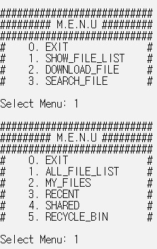
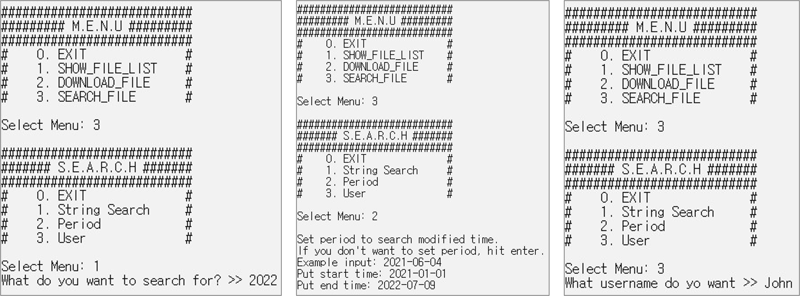
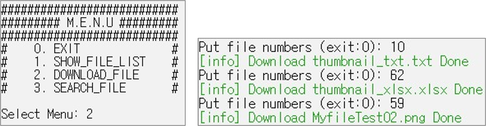

# CATCH - OneDrive

# INTRODUCTION

Investigative framework,
**CATCH (Cloud Data Acquisition through Comprehensive and Hybrid Approaches)**, in order to explore, filter and collect all accessible metadata as well as contents from remote cloud servers by using both Open and Internal APIs.

**CATCH Internal** is a tool that implements data collection through the Internal API in the CATCH framework. (Open API will be updated later.)

#### CATCH Framework


##### Authentication
Authentication for getting authentication data to call web APIs, in order to access cloud resources from endpoint clients.

##### Exploration
Exploration of metadata of resources without downloading their contents.

##### Filtering
Filtering for selective data collection.

##### Collection
Collection for downloading contents of all or selected resources.


# Building - Windows

## Python
To build CATCH Internal - OneDrive, The Python 3.7 or above.
The Python 3.7 or above must be registered in the system environment variable.

## Git
On Windows download git from:  [http://git-scm.com/download/win](http://git-scm.com/download/win)

To get the source Using git run:

```
git clone https://github.com/dfrc-korea/CATCH_Internal-OneDrive.git
```

## Install CATCH Internal - OneDrive
To run CATCH, We must change Powershell Execution Policy.

Execute Powershell as administrator:
```
Set-ExecutionPolicy Unrestricted
```

And enter
```
A
```

Installing the Requirements Library to Run in PowerShell:
```
.\build.ps1
```

# Usage
## Run
Open Folder:
```
cd CATCH_Internal-OneDrive
```

Activate venv(if not activated):
```
cd venv\Scripts
Activate.bat
```

Run CATCH Internal:
```
python CATCH_Cloud_Core.py
```

## Step
### Login


CATCH can log in to OneDrive using the user credentials. Collect authentication information during the login process.
CATCH can also log in using **2-Factor**.

**Currently, only OneDrive is available**

### Show File List



CATCH show a list of files in five categories.
1. All File List: Data stored in all subcategories are integrally displayed.
2. My Files: Contains regular file(s) and folder(s)
3. Recent: Contains recently accessed files
4. Shared: Contains files that are shared with other people
5. Recycle Bin: Contains deleted file(s) and folder(s)

### Search



CATCH provides the following search functions.
1. String Search: String search using Request URL.
2. Period: Data in a specific period is searched using metadata.
3. User Name: User Name search using metadata.

### Download



CATCH can download files by selecting a file index or typing the download url directly into the web.

# Output
## Response - Stored Data(JSON)
CATCH uses the Internal API to explore and collect data. JSON files corresponding to the response of the Request URL are stored in the './Json' folder.

## Thumbnails
CATCH uses the Internal API to collect thumbnails of files (if exist) and the thumbnails are stored in the './Thumbnails' folder

## Downloaded Files
Files downloaded using the file index are stored in the './download' folder.

# Issues and Future Work

**CATCH Internal - OneDrive** is an early version and has several issues.

1. System Management - Error Handling
2. Analysis and Implementation of 2-Factor Authentication Methods Different Countries
3. Download Error: If CATCH cannot download it through the file index, we must give a time interval or enter the download URL directly on the web. Further analysis is in progress.
