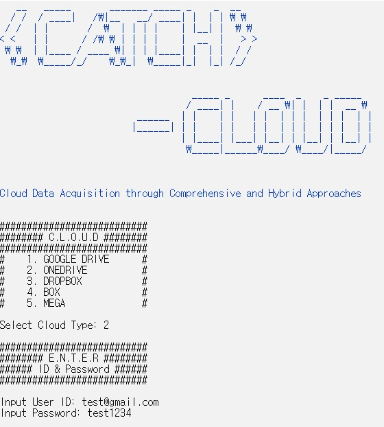

# CATCH Internal - OneDrive

# INTRODUCTION

Investigative framework,
**CATCH (Cloud Data Acquisition through Comprehensive and Hybrid Approaches)**, in order to explore, filter and collect all accessible metadata as well as contents from remote cloud servers by using both Open and Internal APIs.

**CATCH Internal** is a tool that implements data collection through the Internal API in the CATCH framework.

#### CATCH Framework


##### Authentication
Authentication for getting authentication data to call web APIs, in order to access cloud resources from endpoint clients.

##### Exploration
Exploration of metadata of resources without downloading their contents.

##### Filtering
Filtering for selective data collection.

##### Collection
Collection for downloading contents of all or selected resources.


# Building - Windows

## Python
To build CATCH Internal - OneDrive, The Python 3.7.x is required.
The Python 3.7.x must be registered in the system environment variable.

## Git
On Windows download git from:  [http://git-scm.com/download/win](http://git-scm.com/download/win)

To get the source Using git run:

```
git clone https://github.com/dfrc-korea/CATCH_OneDrive.git
```

## Install CATCH Internal - OneDrive
To run CATCH, We must change Powershell Execution Policy.

Execute Powershell as administrator:
```
Set-ExecutionPolicy Unrestricted
```

And enter
```
A
```

Installing the Requirements Library to Run in PowerShell:
```
.\build.ps1
```

# Usage
## Run
Open Folder:
```
cd CATCH_OneDrive
```

Activate venv(if not activated):
```
cd venv\Scripts
Activate.bat
```

Run CATCH:
```
python CATCH_Cloud_Core.py
```

## Step
#### Login


